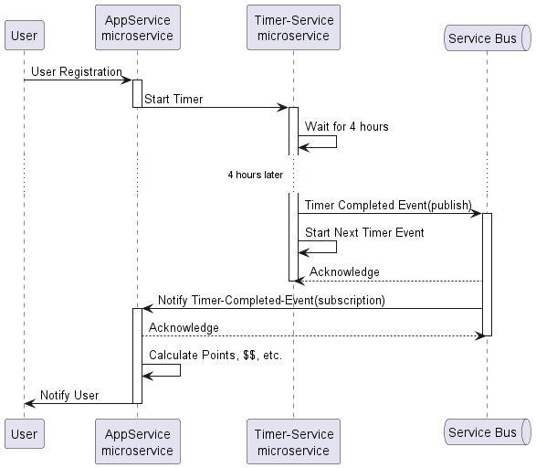

# User Timer Service

This project is a microservice-based application that manages user timers. It uses AWS DynamoDB for data persistence and includes several APIs for managing timers. The sequence of operations is defined in the [`timer.puml`](src/main/spec/timer.puml) file, and the API usage is defined in the [`TimeController API.postman_collection.json`](TimeController%20API.postman_collection.json) file.

## Architecture

The architecture of the User Timer Service is depicted in the [`timer.puml`](src/main/spec/timer.puml) file.

## Sequence Diagram



Below is a summary of the sequence of operations:

1. **User Registration**: The user registers through the `AppService` microservice.
2. **Start Timer**: The `AppService` sends a request to the `TimerService` to start a timer.
3. **Wait for 4 Hours**: The `TimerService` waits for 4 hours.
4. **Timer Completed Event**: After 4 hours, the `TimerService` publishes a "Timer Completed" event to the `Service Bus`.
5. **Start Next Timer Event**: The `TimerService` starts the next timer event.
6. **Notify Timer-Completed-Event**: The `Service Bus` notifies the `AppService` of the timer completion.
7. **Calculate Points and Notify User**: The `AppService` calculates points, rewards, etc., and notifies the user.

## API Endpoints

The API endpoints for managing timers are defined in the [`TimeController API.postman_collection.json`](TimeController%20API.postman_collection.json) file. Below are the details of each endpoint:

### 1. Start Timer

- **Endpoint**: `POST /timers/start`
- **Description**: Starts a timer for a given LPA ID.
- **Headers**:
  - `Content-Type: application/x-www-form-urlencoded`
- **Body Parameters**:
  - `lpaId` (text): The LPA ID for which to start the timer.
- **Example Request**:
  ```sh
  curl -X POST http://localhost:8080/timers/start \
    -H "Content-Type: application/x-www-form-urlencoded" \
    -d "lpaId=12345"

### 2. Get All Active Timers
- **Endpoint**: GET /timers/active
- **Description**: Retrieves all active timers.
- **Example Request**:
  ```sh
  curl -X GET http://localhost:8080/timers/active

### 3. Get All Stored Timers
- **Endpoint**: GET /timers/all
- **Description**: Retrieves all stored timers.
- **Example Request**:
  ```sh
  curl -X GET http://localhost:8080/timers/all

### DynamoDB Configuration
The service uses AWS DynamoDB for data persistence. Ensure that you have the necessary AWS credentials and permissions to access DynamoDB. The DynamoDB Local instance can be configured using Docker Compose as follows:

    version: '3.8'

    services:
    dynamodb-local:
        image: amazon/dynamodb-local
        container_name: dynamodb-timer-local
        ports:
        - "8001:8000"
        environment:
        - AWS_ACCESS_KEY_ID=test_access_key_id
        - AWS_SECRET_ACCESS_KEY=test_secret_access_key
        - AWS_REGION=us-west-2
        volumes:
        - dynamodb_data:/home/dynamodblocal/data
        command: "-jar DynamoDBLocal.jar -sharedDb"

        volumes:
        dynamodb_data:

## Steps to Run DynamoDB Local
#### 1. Start DynamoDB Local:
    docker-compose up -d

#### 2. Stop DynamoDB Local:
    docker-compose down

### Running the Service
#### 1. Clone the Repository:
    git clone https://github.com/kundusandeepan/usertimer.git
    cd usertimer

#### 2. Set Up Environment Variables: Ensure you have the necessary environment variables set for AWS credentials.

#### 3. Start the Service:
* Open a terminal or command prompt.
* Navigate to the project directory.
* Run the following command to start the application:

    ```
    java -jar myapp.jar
    ```


#### 4. Use the API Endpoints: Use the API endpoints defined above to interact with the service.

### License
This project is licensed under the MIT License. See the LICENSE file for details.

This README provides an overview of the User Timer Service, its architecture, API endpoints, and how to set up and run the service using DynamoDB Local. For more detailed information, refer to the source code and documentation within the repository. ```